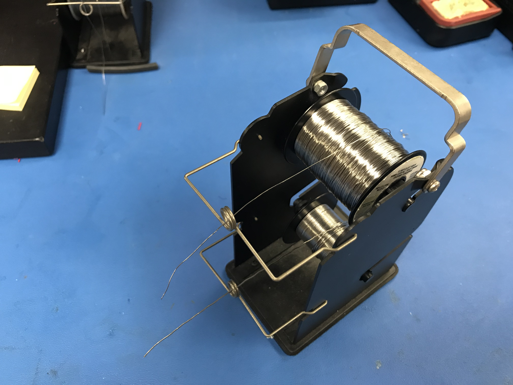

# IT IS VERY IMPORTANT TO KNOW WHERE YOUR SOLDERING IRON IS WHILE IT IS ON AND HOT. THIS IS VERY HOT TOOL SO PLEACE BE CAREFUL WHEN PLACING IT DOWN AND MAKE SURE THAT YOU DO NOT TOUCH THE TIP OF THE SOLDERING IRON OR ANY SURFACE AS IT WILL CAUSE ITEMS TO BURN

## Soldering Basics
This tutorial is for first time beginners to understand soldering practices, techniques, and procedures. Soldering is the practice
of melting soldering to create a strong conductive connetion between components. Solder is a ally that can be either lead based or
lead free. Each type has a different type of chemical composition. Listed below are some of the tools used in soldering and their
purpose. The images shown below are the tools that were used to create some of the components. These tools pictured are different than those show in the "ToolList". 

### Soldering Iron

This is the heated element that melts the solder. The tip of this tool becomes extremely hot so please make sure that you know where this tool is at all times and be very careful when handling. Most times, these tools will come with some type of holder that will allow you to 
store this tool while it is hot. 

### Soldering

This image shows soldering that is set up in holder. Soldering comes in varying thickness.

### Soldering Station

Some Soldering Irons come with a soldering station while others may not. A soldering station usually controls the temperature of the soldering iron and also provides a stand which to place the soldering when not in use.

### Soldering cleaning station featuring brush wire and sponge

This cleaning station removes oxidized soldering which you should do each time before you make a new electrical connection. This features two different types of cleaning techniques. One is the wire brush and the other is a wet sponge. Both will be explained later in this tutorial.

### Wire Strippers

This tools removes the plastic jacket that covers most wires. There are a series of cutting size that match the gauge of the wire. This will allow you to cut through the plastic jacket without cutting through the wire. 

# Soldering two wires together (Tinning Technique)
This first part will describe how to connect two wires together. This will require you to tin both wires and then melt them together to create the electrical contact. 

## Step 1: Stripping the wires
Hold the wire and place the wires strippers around the corresponding wire size. You will need to go a few size up meaning that if you are using a 22AWG (American Wire Gauges) then you will most likely use the 24 or 26 size cutting surface. Squeeze the wires cutters just as you would squeeze a pair of scissors and gently move the wire strippers away from the wire. 

## Step 2: Setting up the Soldering Iron/ Soldering Iron Station
Make sure that the soldering iron is in it's holder and follow the instructions provided by the manufacture if you purchased that soldering iron. 

## Step 3: Priming the Soldering Iron
Once the soldering Iron is hot and ready for you you will need to prime the time. You perform this task by melting a small amount of soldering onto the soldering iron tip. Only hold this for about 2 to 3 seconds and make sure that is a not a large blob. 

## Step 4: Tinning each of the wires
If you have purchased the third hand then that device will come in very useful however, it is not necessary. After priming the soldering iron tip, tin the two wires by holding the tip against the exposed wires and placing the solderin opposite of the soldering iron. This will cause the soldering to melt through wire. 

